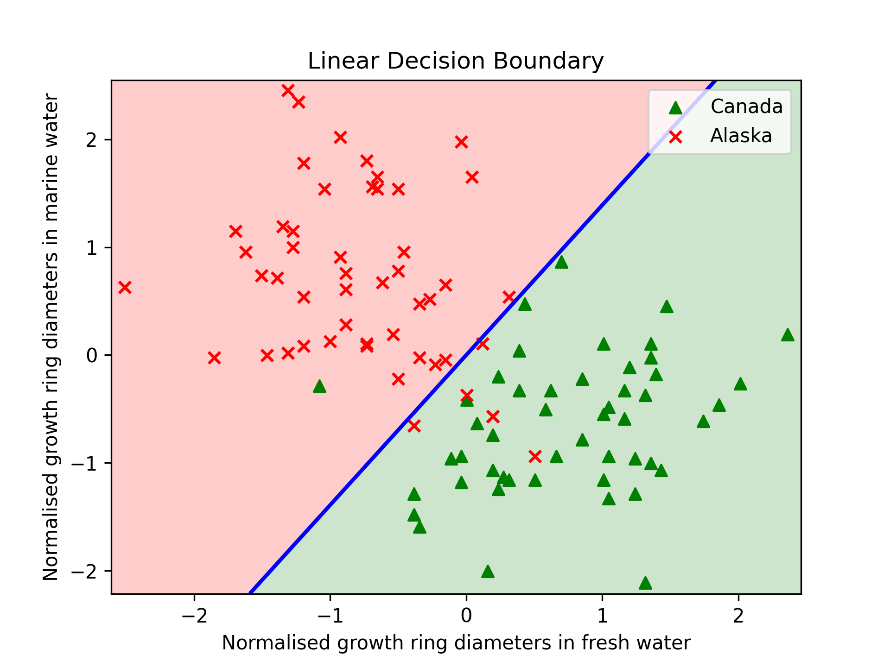

# Machine Learning Assignments
My code for the assignments of course COL774 taken by Prof. Parag Singla at IIT Delhi

     
     
     

### Assignment 1 | Linear & Logistic Regression, Newton's method, GDA

The main code implementations for this assignment can be found [here](./assignment1/) and the report can be found [here](./assignment1/COL774_ass1_report.pdf).

### Assignment 2 | Naive Bayes and SVMs

The main code implementations for this assignment can be found [here](./assignment2/) and the report can be found [here](./assignment2/COL774_ass2_report.pdf).

### Assignment 3 | Decision Trees and Neural Networks

The main code implementations for this assignment can be found [here](./assignment3/) and the report can be found [here](./assignment3/COL774_ass3_report.pdf).
