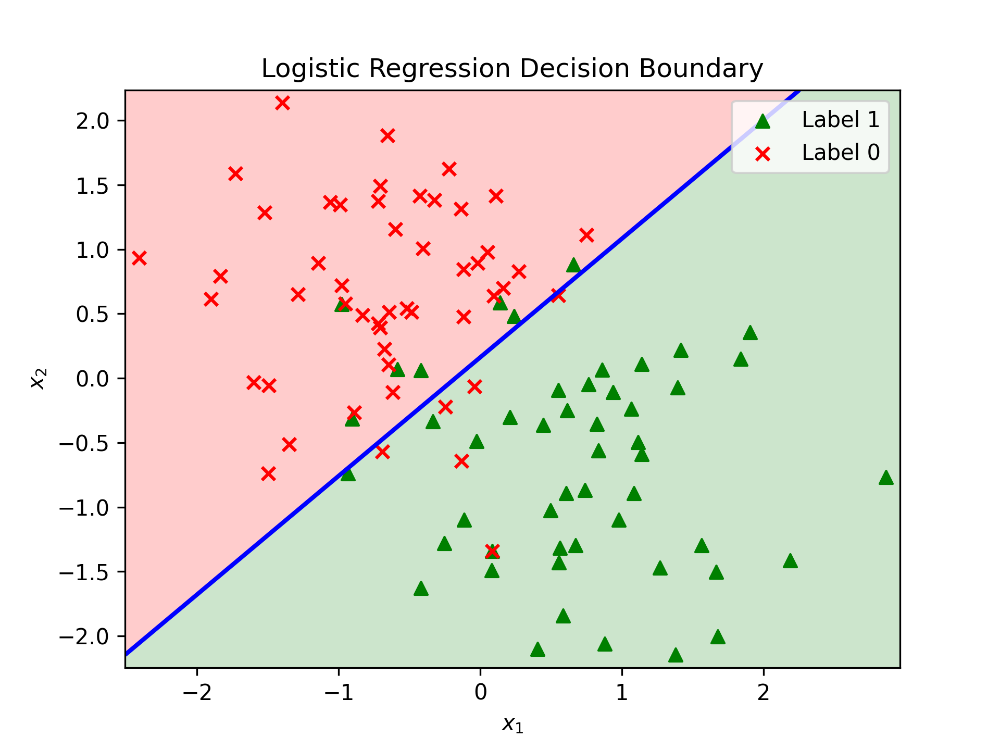
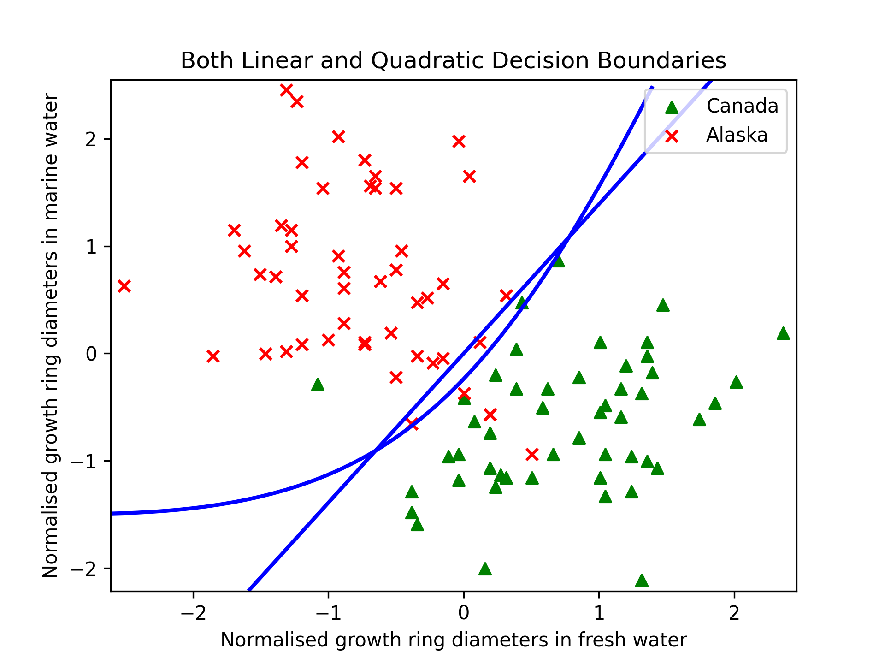
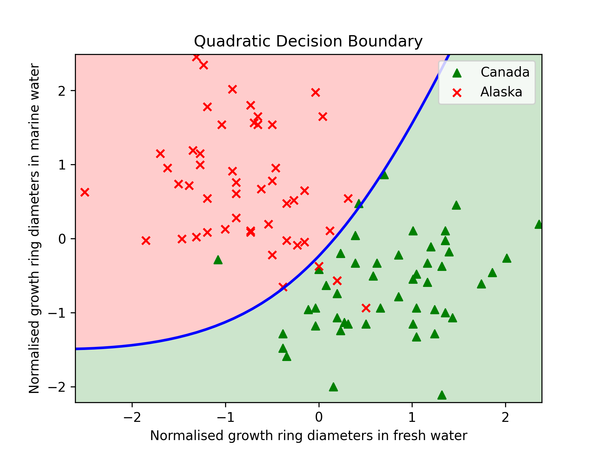

# Assignment 1

### Linear Regression | Gradient Descent

Implementing Gradient Descent algorithm to compute optimal parameters for a linear hypothesis. At each training step, the gradient of the MSE loss is computed, and used to take one step, with the step size (or learning rate) set as 0.1. The change of loss with change in parameters, along with change in the hypothesis, as the model is trained, can be seen in the gif below. 

     

Further detailed analysis of the algorithm for different step sizes (or learning rates) can be found in the [report](./COL774_ass1_report.pdf), while the code implementation can be found in [Q1](./Q1).

### Stochastic Gradient Descent

Implementing stochastic gradient descent for learning in datasets of larger magnitudes. Experimentation with different batch sizes, and comparing the learning process qualitatively (smootheness of loss) and quantitatively (difference in losses, time for convergence).

     
     
     
     Variation of training loss for batch sizes 1, 100 and 10000.

### Newton's Method | Logistic Regression

Implementing Newton's Method to optimise a logistic regression task. Train a Logistic regression model to get a linear decision boundary for the given data. Computes the hessian of the logistic loss as required by the update in Newton's method.

     

### Gaussian Discriminant Analysis

Implementing GDA for classification. Work with two variants, one with assumption that the two classes have same variance, while the other a general case. Visualise the linear and quadratic decision boundaries obtained in the two variants and qualitatively compare them. 

     
     
     

