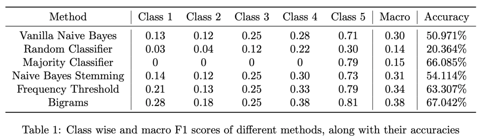

# Assignment 2

### Naive Bayes

Training a simple review rating system using Naive Bayes text classification. Implemented the base Naive Bayes algotrithm with Laplace Smoothing. Experimented with bigrams and other methods of feature engineering to improve the performance further.

     

### SVMs Binary Classification

Training a custom SVM on MNIST data to classify between two of the 10 digits. Furthur analysing the support vectors and weights for both linear and gaussian kernel functions. Used CVXOPT library to solve the dual optimisation function of SVMs, and finally compared the performance of this SVM with openly available module LIBSVM.

### SVMs Multi-Class Classification

Extending binary classification to multi-class by a one vs one approach. Trained 45 classifiers for each pair of classes and then used voting to decide the final class. Again experimented for linear and gaussian kernels and LIBSVM implementation. Further used k-fold cross validation to estimate the performance of the model better.